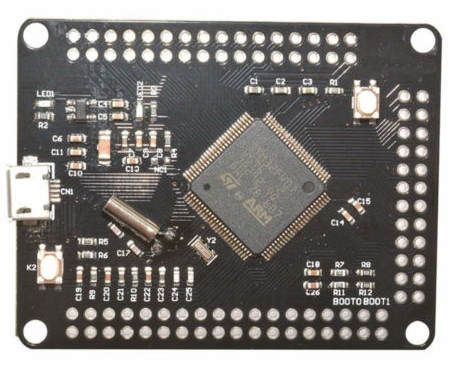

# STM32F407VG-Micropython
Notes on putting micropython on STM32F407VG bare board

For the moment, cross-reference with this site may be of use:
https://github.com/BLavery/STM32F407VG-Arduino

The DIY board MCU is '407VG. This is similar enough to '405RG used on the PyBoard. http://docs.micropython.org/en/v1.9.2/pyboard/pyboard/general.html

We can steal its micropython binary to use on our board. Here is what I did:

 - In boot mode,
 - on linux (debian mint),
 - which has dfu-util available,
 - with merely a USB connection,
 - using the standard latest firmware image from here: http://micropython.org/download 
 
... we can put a PYBOARD micropython image on this board:

 - sudo dfu-util -a 0 -D pybv10-20181205-v1.9.4-712-gc6365ffb9.dfu      (your dfu file)
 
Swap the boot jumper from boot1 to boot to re-enable run mode and reset. A new "drive" appears on my filemanager, "PYBFLASH", with empty boot.py and main.py already present.  The DIY board has a LED on PE0. Use any editor to put this into main.py:

```
import machine, time
time.sleep(3)
PE0 = machine.Pin.cpu.E0
led=machine.Pin(PE0, machine.Pin.OUT)
while 1:
  led.high()
  time.sleep(1)
  led.low()
  time.sleep(1)
```

Save. Reset board. Lo, a led blinks. 

To get serial communication, attach a 3V uart tp TX/RX pins (PA9 / PA10) and run a serial terminal utility. (I use gtkterm). A couple of presses, and the REPL prompt of micropython is there. 

A new world beckons.

